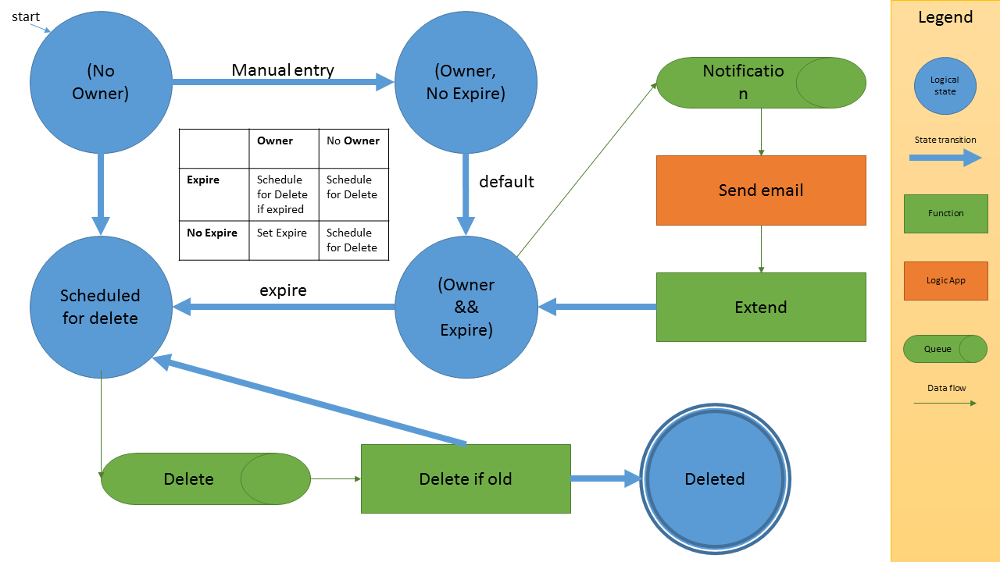

> Note: This project is unmaintained, and it's design should be refreshed according to development in Azure since. Most notably: The usage of PowerShell in Azure Functions, and the introduction of EventGrid for triggering functions.

Azure GC (Garbage Collector) - a governance tool to keep shared Azure subscriptions tidy. 

This tool can help you govern shared Azure subscriptions, keeping track of who owns what, and automatically cleanup of expired resources.

## Overview

Everyone is a `contributor` on this subscription and can create as many resources as they please. The only requirement is to claim ownership of resources so that we keep control of who owns what. Ownership is always temporary in order to keep resource from going stale.  

The system will automatically delete unclaimed (or expired) resources, set expiration date for newly claimed resources, and notify owners of nearing expiration while allowing them to extend their ownership.

## Implementation details

Use ARM tags to keep track of ownership and expiration. Tag at the Resource Group level, and not individual resources. Make use of two tags:

- 'Owner' - The user who claims ownership of the resource. Format: email.
- 'Expire' - The date when the ownership expires. Format: 'yyyy-MM-dd'.

You should [lock important resource group](https://docs.microsoft.com/en-us/azure/azure-resource-manager/resource-group-lock-resources) in order to protect them from accedential deletion (or bugs in this tool). At the very least, lock the resource group which hold this system (the AzureGC system).

You could also [enforce tagging of resources](https://docs.microsoft.com/en-us/azure/azure-resource-manager/resource-manager-policy#policy-definition-examples), I personally prefer not to.

## Deploying

See [Deploying](docs/deploying.md)

## Architecture

The system is comprised of several Azure Functions. I have found it to be a very elegant way to solve these kind of problems. What's even more convenient is that Azure Functions natively supports PowerShell, which makes automating Azure resources very easy.

The basis is 3 scheduled functions that groom resource groups and tags: 

1. 'noOwner' - Looks for unclaimed or expired resources, and queue the for deletion (regardless of Expire)
2. 'owner-NoExpire' - Look for claimed resources without expiration, and set default expiration to them.
3. 'owner-expire' - Look for expired ownerships, and disown them (making them available for collection by 'noOwner-noExpire).

Additionally the are 2 queue based functions:

1. 'delete-rg' - Send email notifications for nearly expiring resources.
2. 'extend-ownership' - Allow owners to extend their ownership period.

Final piece is an automated email reminder that is sent to owners. This is implemented by a logic app.

The following diagram depicts the components in the system, and the relationship between them:

## FAQ

Q: Why Functions, isn't this what Azure Automation supposed to do?  
A: I have initially started this project on Automation, but when things evolved in terms of complexity, and also Functions because more mature I decided to try it out. I find Functions to be much more elegant solition for this kind of tasks.

Q: Why PowerShell?  
A: Since PowerShell is awesome. Since the audience for this tool is mostly sys-admins. Since Azure management is most mature with PS.

Q: Why Storage Queues and not Service Bus?  
A: Because Functions already relies on Azure Storage Queues and I didn't want to create an additional dependency.

Q: Tag values are not validated. What keeps people from setting very long expiry, or setting someone elase as owner?  
A: Nothing. This is not a strict enforcing system. This is a tool to help you and your team manage your stuff. If someone needs more than a week, they are welcome to set the expiry to as long as they need; If someone wants to transfer ownership to a colleague, they can easily do so. This tool is meant to be used in a friendly environment.

A: The 'extend-ownership' HTTP function is insecure, anyone can extend any resourc!  
Q: Yes, as long as they have RBAC permission. Again, this is not a strict enforcing system. This is a tool to help you and it's meant to be used in a friendly environment.
